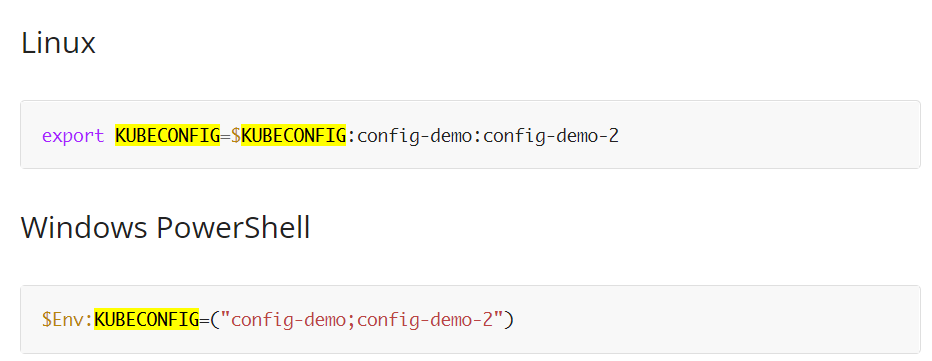

## k8s 작업 환경 설정
`2022.03.15. 박연구(Github @yg-park) 진행`

## 환경
WSL2 (ubuntu)

### Lens 설치 (Windows App)
> CommandLine 환경에서 쿠버네티스를 운영하는 것이 불편하기 때문에, 
> 별도의 IDE 를 설치하여 쿠버네티스 리소스들을 모니터링 할 수 있다.

### 설치 및 접속설정

* https://k8slens.dev/ 에서 다운로드
* kubeConfig 파일 다운로드
* Lens 실행 및 kubeConfig 파일 추가


### kubectl 설치 (CLI tool)

아래 명령어로 설치
```bash
curl -LO https://storage.googleapis.com/kubernetes-release/release/`curl -s https://storage.googleapis.com/kubernetes-release/release/stable.txt`/bin/linux/amd64/kubectl
chmod +x ./kubectl
sudo mv ./kubectl /usr/local/bin/kubectl
kubectl version --client
```

### kubectl 설정
**Lens 에서 설정했던 kubeConfig 파일을 WSL 로 옮겨주는 작업이 이미 되었다고 가정한다.**

예시:
kubeConfig 위치/파일명: `~/.kube/selab-cluster`
```
cat <<EOF >> ~/.bashrc
# Kubernetes
source <(kubectl completion bash)
alias k=kubectl
complete -F __start_kubectl k
# Cluster 설정
export KUBECONFIG=~/.kube/selab-cluster
EOF
```

### 클러스터 연결 확인

위에 설정한 Cluster에 접속이 되는지 확인한다.
```bash
k get nodes

#########################
# 대략 이렇게 나와야 함
NAME      STATUS                     ROLES                  AGE   VERSION
master1   Ready                      control-plane,master   18d   v1.23.1
master2   Ready                      control-plane,master   18d   v1.23.1
master3   Ready                      control-plane,master   18d   v1.23.1
node10    Ready                      <none>                 18d   v1.23.1
node8     Ready                      <none>                 18d   v1.23.1
node9     Ready                      <none>                 18d   v1.23.1
vnode3    Ready,SchedulingDisabled   <none>                 18d   v1.23.1
```

---

## 직접 따라 해보기
### Lens 설치  
  
Lens 설치 후 위와 같은 화면이 첫 화면으로 뜬다. Github 등으로 로그인 한다.

  
위와 같이 Clusters -> config 파일 불러와 연동한다.  
Lens 첫화면에서 Clusters 클릭한 후, 우측 하단 + 버튼을 hover, 가장 상단에 팝업되는 Sync kubeconfig file(s) 버튼을 클릭한다.  
파일 브라우저가 열리면 다운로드 받은 kubeconfig 파일을 선택 해 준다.    


ubuntu를 켜고 kubectl을 CLI로 설치 해 준다.  


  
  
위 경로,`~/.kube`에 config 파일을 위치시킨다.
```bash
root@LAPTOP-CDK4T77H:/mnt/c/users/codep/.azure# cp selab-cluster-config /home/codepark/.kube
```


다음과 같이 kubectl의 기본적인 환경 설정을 진행한다.
(The kubectl completion script for Bash can be generated with the command kubectl completion bash.
**Sourcing the completion script in your shell enables kubectl _autocompletion_**. bash용 kubectl의 completion script는 kubectl completion bash 명령을 사용하여 생성이 가능하다. 
쉘 스크립트 기반의 자동 완성 스크립트는 kubectl의 자동 완성을 허용한다.)


`alias k=kubectl`은 kubectl을 축약어 별칭을 설정하고, 환경 변수 KUBECONFIG를 설정한다. 

The KUBECONFIG environment variable is a list of paths to configuration files. 
The list is colon-delimited for Linux and Mac, and semicolon-delimited for Windows. 
If you have a KUBECONFIG environment variable, familiarize yourself with the configuration files in the list.  
KUBECONFIG 환경 변수는 설정 파일 경로의 목록이다. 이 목록은 리눅스와 맥에서는 콜른(`:`)으로, 윈도우에서는 세미콜론(`;`)으로 단락이 분절된다. KUBECONFIG 환경 변수를 가지고 있다면, 목록 내 설정 파일들을 숙지하라.  

예를 들면 이런 식이다:  




  


이제 다음과 같이 alias k = kubectl을 통한 작업이 가능하다.
```
k get nodes
k get pod
```

  

---

## 오늘의 리눅스 커맨드

> ### 파일명 변경하기
> `mv [ORIGINAL-FILENAME] [NEW-FILENAME]`  
> e.g. `mv selab-cluster-config selab-cluster`
>
> ### 파일 복사하기
> `cp [FILENAME] [DESTINATION]`  
> e.g. `cp selab-cluster ~/mnt/c/Users/codep/.kube/`

### 레퍼런스
**공식 문서**  
[리눅스에서의 kubectl bash 설정](https://kubernetes.io/docs/tasks/tools/included/optional-kubectl-configs-bash-linux/)  
[kubectl Tip & Cheatsheet](https://kubernetes.io/docs/reference/kubectl/cheatsheet/)  
[복수 클러스터 접근 설정](https://kubernetes.io/docs/tasks/access-application-cluster/configure-access-multiple-clusters/)


